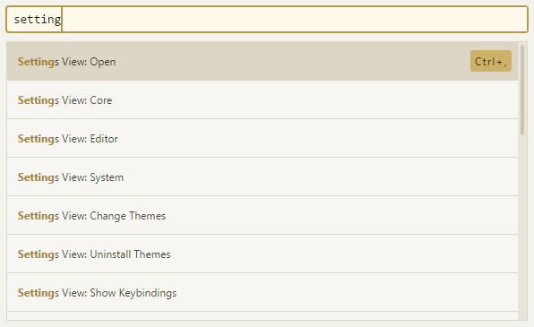

Title: Atom飞行手册的飞行手册
Status: draft

> 通读了一遍[Atom飞行手册](http://flight-manual.atom.io/)的第一章快速入门以及第二章使用Atom，做了简单笔记，方便以后查阅。

### 命令面板
Atom的操作方式是以命令为基础的，不管是菜单功能还是内置的一些快捷键本质上都是执行Atom命令。而命令面板可以直接去执行Atom具备的所有命令，包括但不限于菜单栏上的功能以及快捷键的功能。打开命令面板的方式为快捷键 `cmd-shift-p`，在命令面板上带搜索功能的框中可以输入键字即可搜索到相应命令，点击鼠标左键或者按下回车就可以执行命令。  
如下图就是打开atom设置界面的命令:

打开设置界面 `settings-view:open` or `cmd-,`  
设置界面可以修改主题，个人喜欢UI Theme:OneLight 以及Syntax Theme:Solarized Right
Soft Tabs 选上的话tab就用空格来代替了
Soft Wrap At Preferred Line Length 每行字数超过设置值的话会自动换行显示

你可以通过快捷键 cmd-\ 或 tree-view:toggle 命令来隐藏或重新显示目录树，用快捷键 ctrl-0 可以将焦点切换到目录树。当焦点位于目录树上时，你可以用快捷键 a、m 以及 delete 来创建、移动或删除文件和目录。你还可以简单地在目录树中用右键点击文件，你可以看到更多选项，除了前面提到的，还可以在操作系统的文件浏览器中显示文件、复制文件的路径到剪贴板。

打开目录 `cmd-shift-o`
打开项目中的文件  `cmd-T` or `cmd-P`

你也可以通过 cmd-B 来只查找已经打开的文件，而不是所有文件。你还可以用 cmd-shift-B
来只查找从上次 Git 提交之后修改过或新增的文件

Atom ships with the fuzzy-finder package which provides Ctrl+T to quickly open files in the project and Ctrl+B to jump to any open editor.

Ctrl+Left - Move to the beginning of word
Ctrl+Right - Move to the end of word
Home - Move to the first character of the current line
End - Move to the end of the line
Ctrl+Home - Move to the top of the file
Ctrl+End - Move to the bottom of the file

You can also move directly to a specific line (and column) number with Ctrl+G. This will bring up a dialog that asks which line you would like to jump to. You can also use the row:column syntax to jump to a character in that line as well.

If you press Alt+Ctrl+F2, Atom will toggle a "bookmark" on the current line.
If you hit F2, Atom will jump to the next bookmark in the file you currently have focused. If you use Shift+F2 it will cycle backwards through them instead.
You can also see a list of all your project's current bookmarks and quickly filter them and jump to any of them by hitting Ctrl+F2.

    Shift+Up - Select up
    Shift+Down - Select down
    Shift+Left - Select previous character
    Shift+Right - Select next character
    Ctrl+Shift+Left - Select to beginning of word
    Ctrl+Shift+Right - Select to end of word
    Shift+End - Select to end of line
    Shift+Home - Select to first character of line
    Ctrl+Shift+Home - Select to top of file
    Ctrl+Shift+End - Select to bottom of file
    Ctrl+A - Select the entire contents of the file
    Ctrl+L - Select the entire line

编辑和删除文本

Ctrl+J - Join the next line to the end of the current line
Ctrl+Up/Down - Move the current line up or down
Ctrl+Shift+D - Duplicate the current line
Ctrl+K Ctrl+U - Upper case the current word
Ctrl+K Ctrl+L - Lower case the current word

Ctrl+Shift+K - Delete current line   弹出软键盘  容易与搜狐输入法的快捷方式冲突
Ctrl+Backspace - Delete to beginning of word
Ctrl+Delete - Delete to end of word

Ctrl+Click - Add a new cursor at the clicked location
Alt+Ctrl+Up/Down - Add another cursor above/below the current cursor
Ctrl+D - Select the next word in the document that is the same as the currently selected word
Alt+F3 - Select all words in the document that are the same as the currently selected word

Convert Spaces to Tabs
Convert Tabs to Spaces

    Ctrl+M - Jump to the bracket matching the one adjacent to the cursor. It jumps to the nearest enclosing bracket when there's no adjacent bracket.
    Alt+Ctrl+, - Select all the text inside the current brackets
    Alt+Ctrl+. - Close the current XML/HTML tag

Ctrl+Shift+U - Toggle menu to change file encoding

Ctrl+F - Search within a buffer

Ctrl+Shift+F - Search the entire project

Press Esc while focused on the Find and Replace panel to clear the pane from your workspace

Snippets 默认支持很多语言，也可以自己配置

To see all the available snippets for the file type that you currently have open, choose "Snippets: Available" in the Command Palette.

The autocomplete system lets you view and insert possible completions in the editor using Tab or Enter.

You can also fold and unfold from the keyboard with the Alt+Ctrl+[ and Alt+Ctrl+] keybindings.
To fold everything, use Alt+Ctrl+Shift+[ and to unfold everything use Alt+Ctrl+Shift+].
Finally, you can fold arbitrary sections of your code or text by making a selection and then typing ********Alt+Ctrl+F******** or choosing "Fold Selection" in the Command Palette.
You can also fold at a specific indentation level with Ctrl+K Ctrl+0-9 where the number is the indentation depth.

You can split any editor pane horizontally or vertically by using Ctrl+K Up/Down/Left/Right where the direction key is the direction to split the pane. Once you have a split pane, you can switch between them with Ctrl+K Ctrl+Up/Down/Left/Right where the direction is the direction the focus should move to.
To close a pane, you can close all pane items with Ctrl+W.

***
When you open a new file by single-clicking in the Tree View, it will open in a new tab with an italic title. This indicates that the file is "pending". When a file is pending, it will be replaced by the next pending file that is opened. This allows you to click through a bunch of files to find something without having to go back and close them all.

You can confirm a pending file by doing any of the following:

    Double-clicking the tab of the file
    Double-clicking the file in the tree view
    Editing the contents of the file
    Saving the file

 you can pull up the Grammar Selector with Ctrl+Shift+L.

 Git

 Checkout Head Revision

 You can configure Atom to be your Git commit editor with the following command:

git config --global core.editor "atom --wait"

    Alt+G O - Open file on GitHub
    Alt+G B - Open Blame view of file on GitHub
    Alt+G H - Open History view of file on GitHub
    Alt+G C - Copy the URL of the current file on GitHub to the clipboard
    Alt+G R - Branch compare on GitHub

table

    Open the Git panel: Ctrl+9
    Open the GitHub panel: Ctrl+8

Ctrl+Shift+M - Will toggle Preview mode for Markdown.
If you type img and hit tab you get a Markdown-formatted image embed code like . If you type table and hit tab you get a nice example table to fill out.

Although there are only a handful of Markdown snippets (b for bold, i for italic, code for a code block, etc)
